In this directory are a bunch of JSON files to help with automating PCF configuration and deployment via the Ops Manager API.

Once you have applied a configuration, kick off the deployment with the following (which is the API equivalent of hitting 'apply changes' in the UI):

```
curl -k "https://localhost/api/v0/installations" \
    -X POST \
    -H "Authorization: Bearer $UAA_ACCESS_TOKEN" \
    -H "Content-Type: application/json"
    -d '{"errands": {} }'
```

You'll get back something like `{"install":{"id":1}}`, which you can then poll for `succeeded` or `failed` with:

```
curl -k "https://localhost/api/v0/installations/:id" \
    -H "Authorization: Bearer $UAA_ACCESS_TOKEN"
```

# Examples

Note that these all assume you are running `curl` from the Ops Manager VM.

## Ops Manager Director

- Automate 'AWS Config' page

**NOTE** The `ssh_private_key` value must be a single line, with `\n` in place of all newline characters in the original key file.

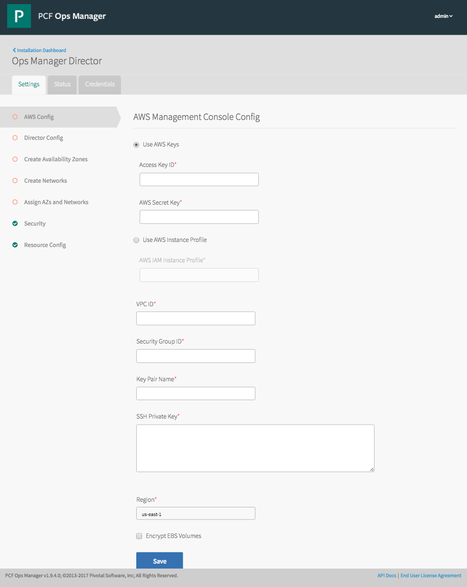

```
curl -k "https://localhost/api/v0/staged/director/properties" \
    -X PUT \
    -H "Authorization: Bearer $UAA_ACCESS_TOKEN" \
    -H "Content-Type: application/json" \
    -d @director-iaas-configuration.json
```

- Automate 'Director Config' page

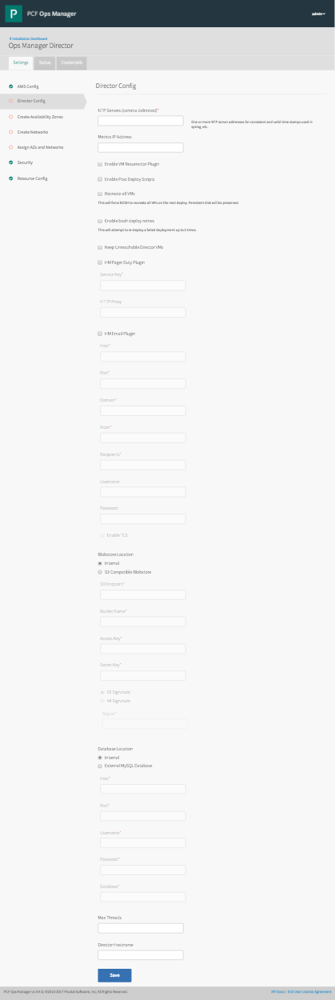

```
curl -k "https://localhost/api/v0/staged/director/properties" \
    -X PUT \
    -H "Authorization: Bearer $UAA_ACCESS_TOKEN" \
    -H "Content-Type: application/json" \
    -d @director-configuration.json
```

- Automate 'Create Availability Zones' page

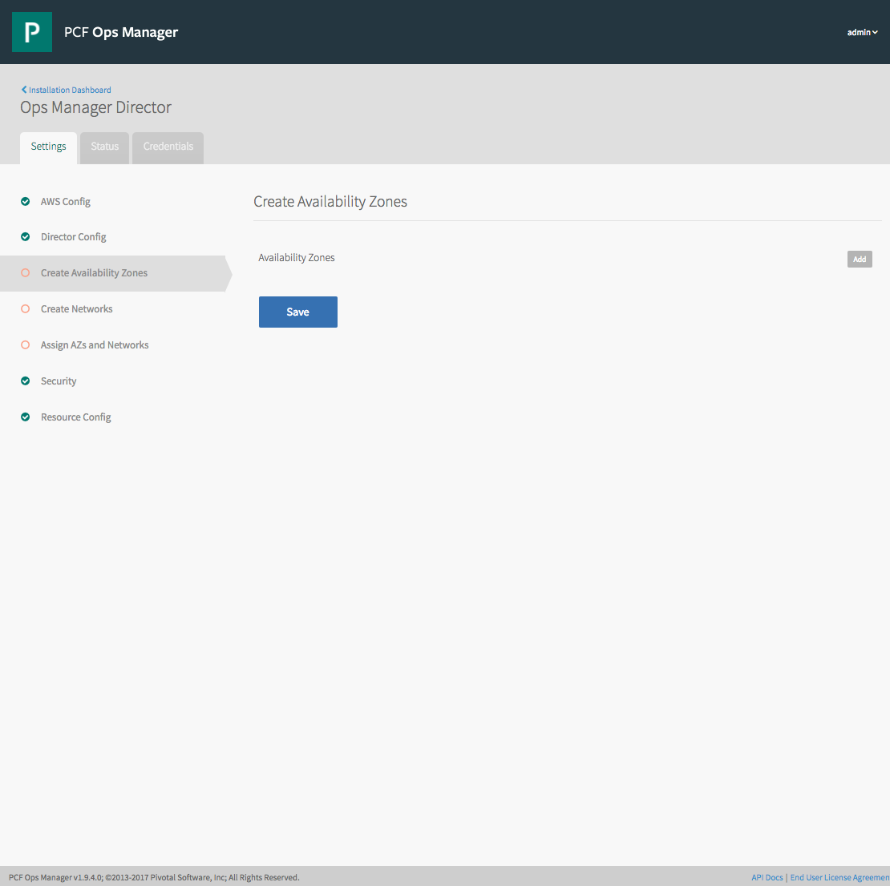

```
curl -k "https://localhost/api/v0/staged/director/availability_zones" \
    -X PUT \
    -H "Authorization: Bearer $UAA_ACCESS_TOKEN" \
    -H "Content-Type: application/json" \
    -d @director-az-configuration.json
```

- Automate 'Create Networks' page

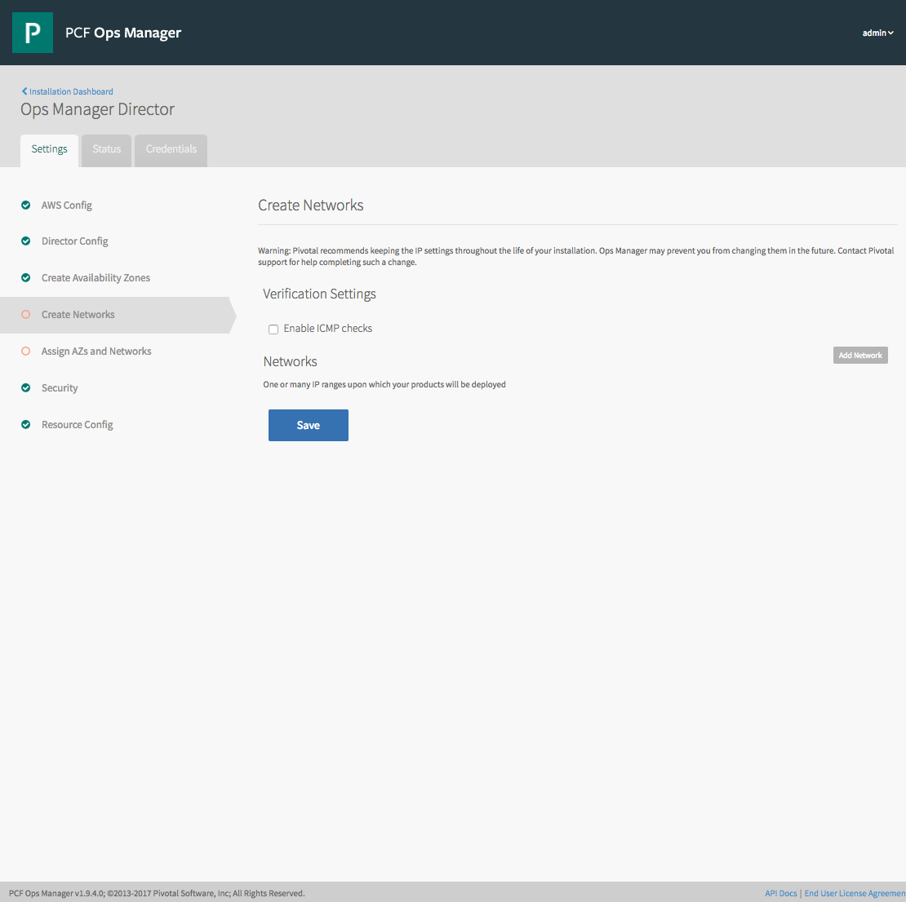

```
curl -k "https://localhost/api/v0/staged/director/networks" \
    -X PUT \
    -H "Authorization: Bearer $UAA_ACCESS_TOKEN" \
    -H "Content-Type: application/json" \
    -d @director-networks-configuration.json
```

- Automate 'Assign AZs and Networks' page

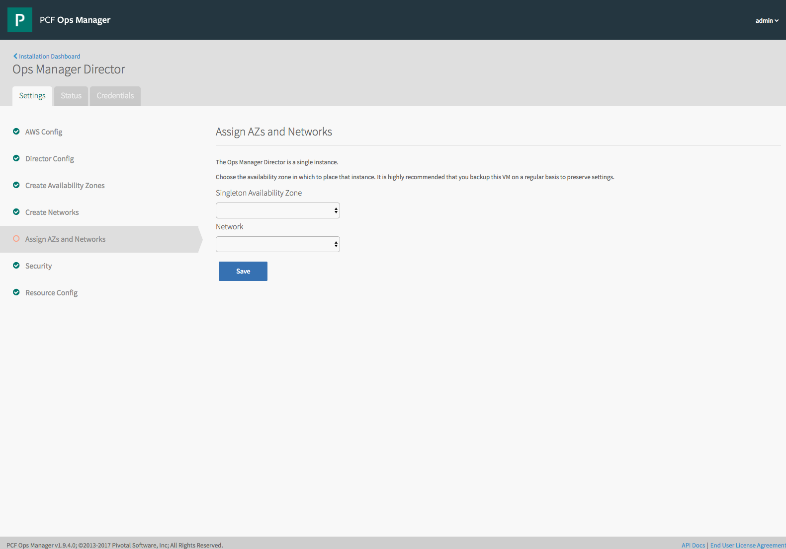

```
curl -k "https://localhost/api/v0/staged/director/network_and_az" \
    -X PUT \
    -H "Authorization: Bearer $UAA_ACCESS_TOKEN" \
    -H "Content-Type: application/json" \
    -d @director-network-az-configuration.json
```

- Automate 'Security' page

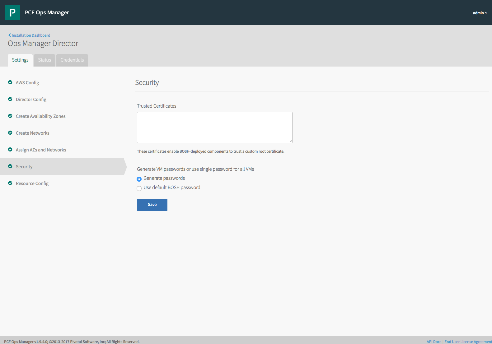

```
curl -k "https://localhost/api/v0/staged/director/properties" \
    -X PUT \
    -H "Authorization: Bearer $UAA_ACCESS_TOKEN" \
    -H "Content-Type: application/json" \
    -d @director-security-configuration.json
```

- Automate 'Resource Config' page

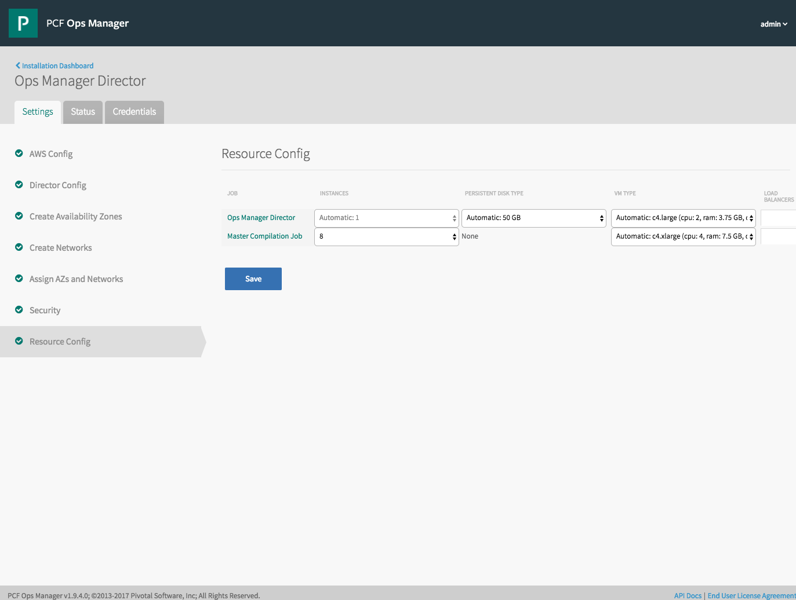

First, get the product `guid`:

```
curl -k "https://localhost/api/v0/staged/products" \
    -H "Authorization: Bearer $UAA_ACCESS_TOKEN"
```

Then get the jobs for the product:

```
curl -k "https://localhost/api/v0/staged/products/:product_guid/jobs" \
    -H "Authorization: Bearer $UAA_ACCESS_TOKEN"
```

Finally, use the *job* `guid` along with the product guid to configure resource configuration for the job/s... in this example, the compilation job:

```
curl -k "https://localhost/api/v0/staged/products/:product_guid/jobs/:job_guid/resource_config" \
    -X PUT \
    -H "Authorization: Bearer $UAA_ACCESS_TOKEN"
    -H "Content-Type: application/json" \
    -d @director-compilation-resource-configuration.json
```

## Elastic Runtime Tile

The bulk of tile configuration is done via 'properties' data structures, but there are a few common parts of any tile such as the network and az configuration, stemcell, errands and job resource configuration. So although these examples are for ERT, they pretty much apply to any tile.

The first thing to do is upload the product:

```
curl -k "https://localhost/api/v0/available_products" \
    -X POST \
    -H "Authorization: Bearer $UAA_ACCESS_TOKEN" \
    -F 'product[file]=@/path/to/product.zip'
```

Then get the product `name` and `product_version` of the uploaded product:

```
curl -k "https://localhost/api/v0/available_products" \
    -H "Authorization: Bearer $UAA_ACCESS_TOKEN"
```

Finally stage it (in this example, Elastic Runtime 1.9.8):

```
curl -k "https://localhost/api/v0/staged/products" \
    -X POST \
    -H "Authorization: Bearer $UAA_ACCESS_TOKEN" \
    -H "Content-Type: application/json" \
    -d '{"name": "cf", "product_version": "1.9.8-build.3"}'
```

To do anything useful, you'll need the product `guid`

get the product `guid`:

```
curl -k "https://localhost/api/v0/staged/products" \
    -H "Authorization: Bearer $UAA_ACCESS_TOKEN"
```

- Configure Networks and AZs

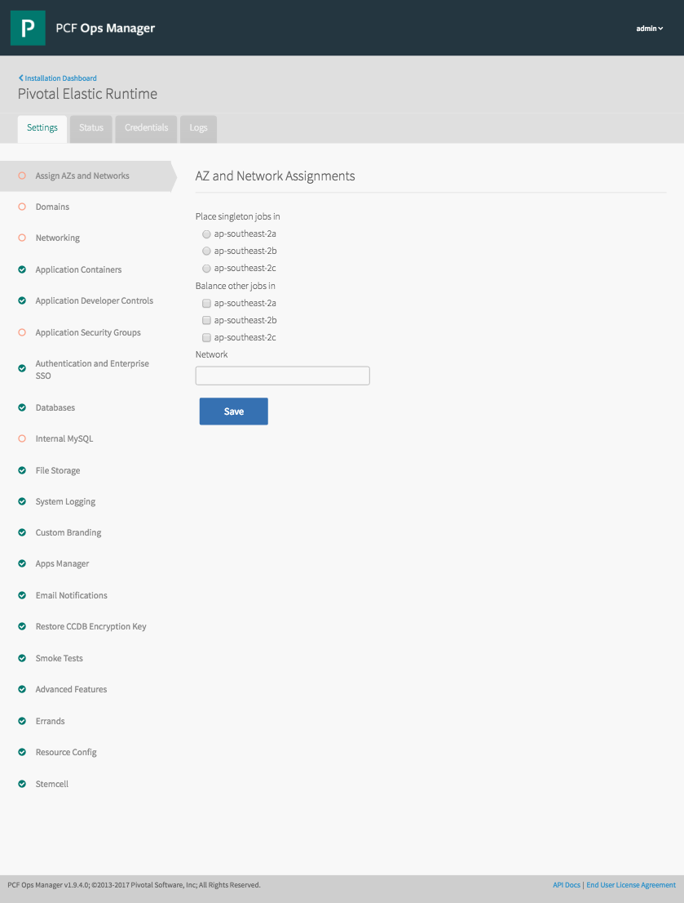

```
curl -k "https://localhost/api/v0/staged/products/:product_guid/networks_and_azs" \
    -X PUT \
    -H "Authorization: Bearer $UAA_ACCESS_TOKEN" \
    -H "Content-Type: application/json" \
    -d @ert-network-az-configuration.json
```

- Configure Properties

There are many properties to configure for ERT, too many to go through here. They are all generically the same however, so a single example should point the way for everything. If in doubt, have a look at the API documentation available at `https://<opsmgr_url>/docs`.

Here is how to configure the Apps and System domains:

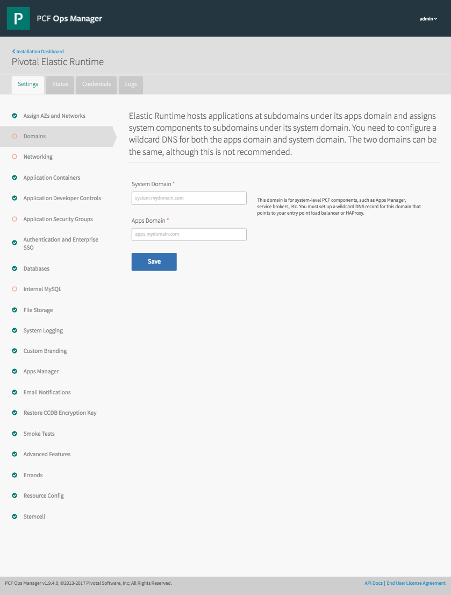

```
curl -k "https://localhost/api/v0/staged/products/:product_guid/properties" \
    -X PUT \
    -H "Authorization: Bearer $UAA_ACCESS_TOKEN" \
    -H "Content-Type: application/json" \
    -d @ert-domains-configuration.json
```

Here is how to configure File Storage (note that whenever a property is of type `secret`, the value must be an object with a key 'secret'):

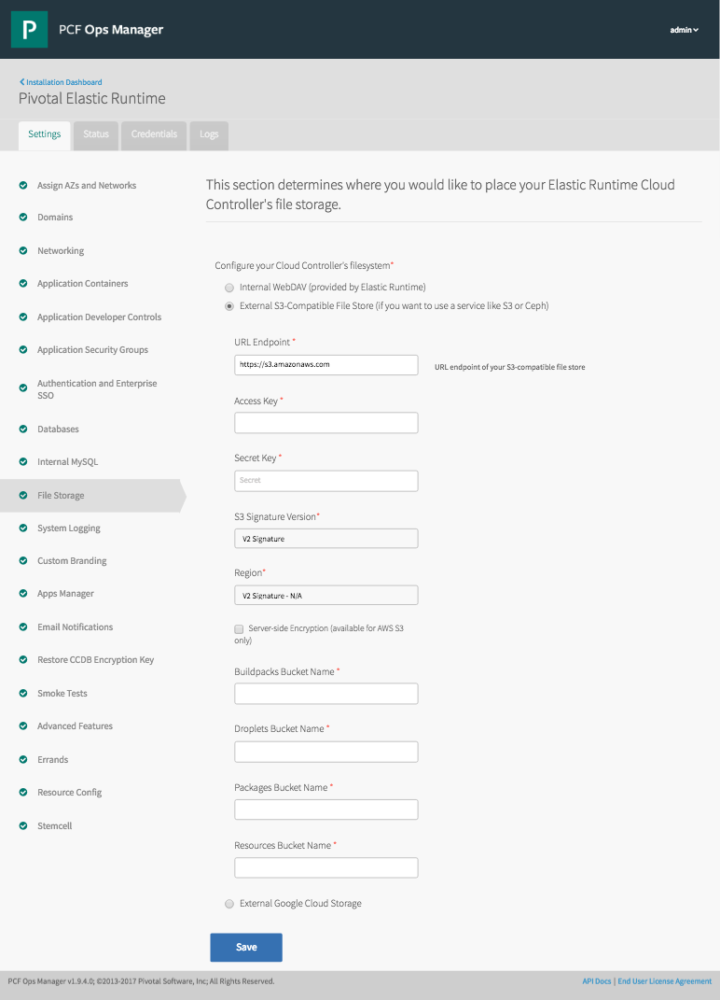

```
curl -k "https://localhost/api/v0/staged/products/:product_guid/properties" \
    -X PUT \
    -H "Authorization: Bearer $UAA_ACCESS_TOKEN" \
    -H "Content-Type: application/json" \
    -d @ert-file-storage-configuration.json
```


- Configure Errands

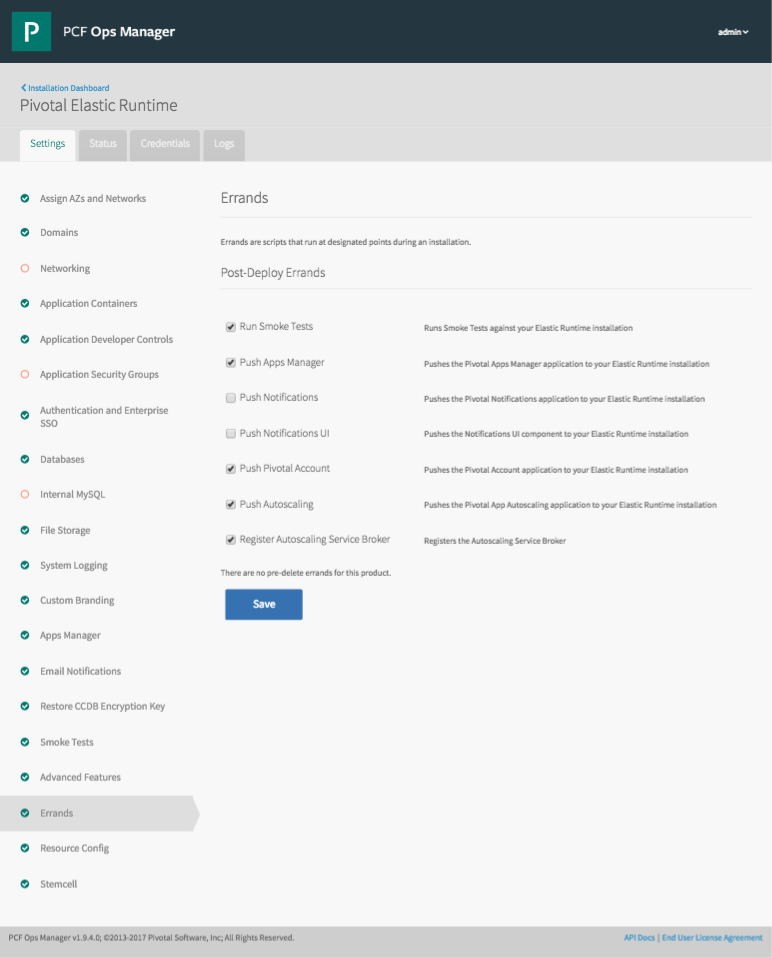

```
curl -k "https://localhost/api/v0/staged/products/:product_guid/errands" \
    -X PUT \
    -H "Authorization: Bearer $UAA_ACCESS_TOKEN" \
    -H "Content-Type: application/json" \
    -d @ert-errands-configuration.json
```

- Configure Job Resources

Already covered at the end of the [Ops Manager Director](#Ops-Manager-Director) section. The list of Elastic Runtime jobs is as follows (remember, you need the job `guid` to configure resources, not just the name... which is obviously unique per-install, I have omitted it below):

```
{
  "jobs": [{
    "name": "consul_server"
  }, {
    "name": "nats"
  }, {
    "name": "etcd_tls_server"
  }, {
    "name": "etcd_server"
  }, {
    "name": "nfs_server"
  }, {
    "name": "mysql_proxy"
  }, {
    "name": "mysql"
  }, {
    "name": "backup-prepare"
  }, {
    "name": "ccdb"
  }, {
    "name": "uaadb"
  }, {
    "name": "uaa"
  }, {
    "name": "cloud_controller"
  }, {
    "name": "ha_proxy"
  }, {
    "name": "router"
  }, {
    "name": "mysql_monitor"
  }, {
    "name": "clock_global"
  }, {
    "name": "cloud_controller_worker"
  }, {
    "name": "diego_database"
  }, {
    "name": "diego_brain"
  }, {
    "name": "diego_cell"
  }, {
    "name": "doppler"
  }, {
    "name": "loggregator_trafficcontroller"
  }, {
    "name": "tcp_router"
  }]
}
```
